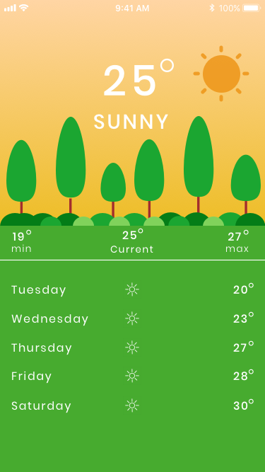
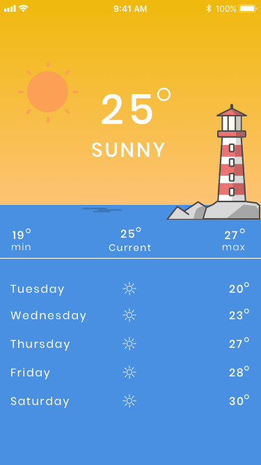

# DVT Weather App Assessment 

To run and build:

1)  To genereate a key please visit https://openweathermap.org/appid
Insert the key into DVTWeather->Services->OpenWeather->OpenWeatherConstants:
 app_key = "appid=key" 
 

Please complete the following: 

Create a weather application to display the current weather at the user's location and a 5-day forecast. 

## Requirements: 

You are required to implement one of 2 designs, the Forest design or the Sea design (see iOS Screen Designs or Android Screen Designs folders). You can choose either one. 

The forecast must be based on the user’s current location. 

The application should connect to the following API to collect the weather information. 

https://openweathermap.org/current 

https://openweathermap.org/forecast5 

You will be required to change the background image depending on the type of weather (Cloudy, Sunny and Rainy). Please use the provided assets and icons. 

Please demonstrate best practices - including but not limited to,  

- Architecture 

- Design Patterns 

- Unit Testing (TDD Preferential) 

- Proper use of the SOLID principles 

- Integration into a CI/CD build pipeline 

- Code coverage integration 

- Static code analysis 

Please note these are additional requirements, complete the ones you are comfortable with to demonstrate your knowledge and experience 

Please also take some initiative and implement some additional features like, 

The ability to save different weather locations as favourites 

The ability to view a list of favourites 

The ability to get extra information about a specific location 

Using something like the Google Places API - https://developers.google.com/places/web-service/intro 

The ability to see weather information while the application is offline (show time last updated etc) 

Allow the user to view saved locations on a map 

Meaning the user should be able to access a map and see all the weather locations they have saved as favourites and where they are now. 

It is up to you to solve this problem using any technology/libraries you want to use. We will be assessing not just your ability to code, but your coding style as well. Please make sure to submit your best attempt at the problem – don’t be afraid to show off if you have the time! 

Please upload the complete solution to a Git repository hosted on either Github, Bitbucket or GitLab. 
